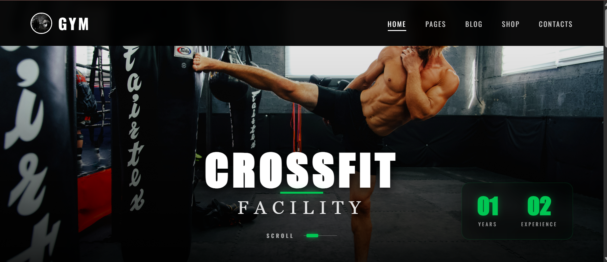
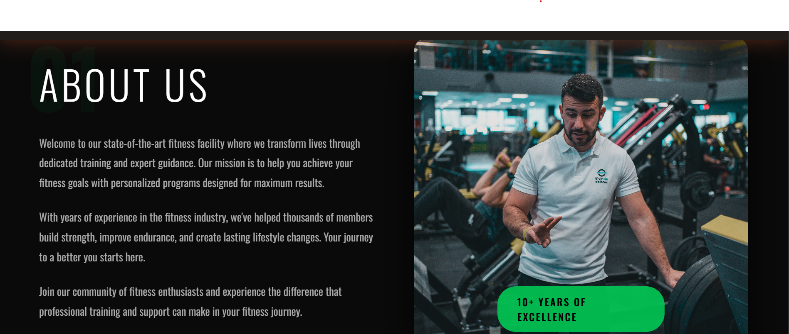
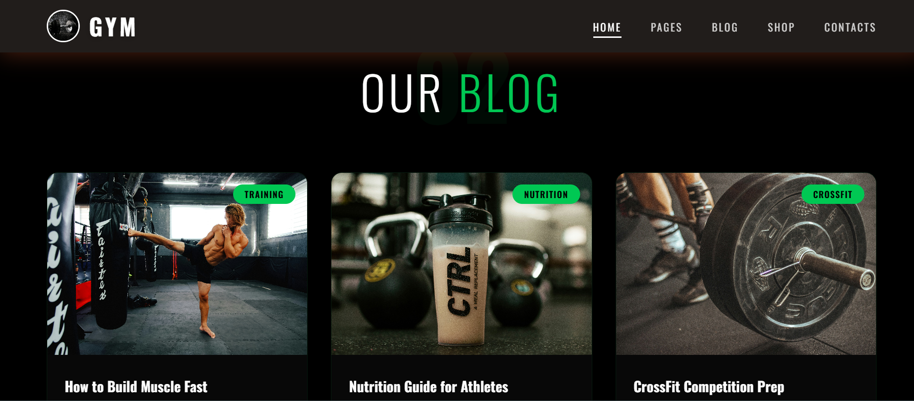
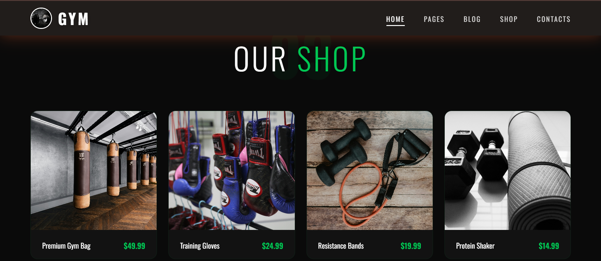
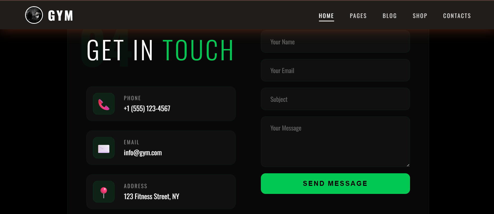
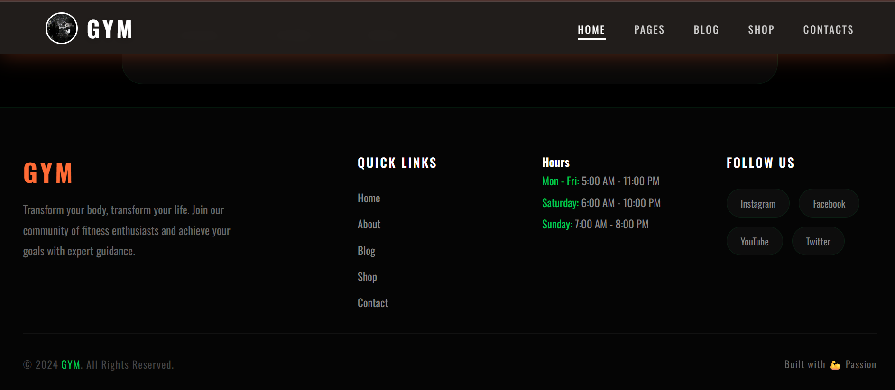

# 💪 GYM - Fitness Website

A modern, responsive fitness website built with React.js, featuring a clean green-themed design, smooth animations, and dedicated sections for fitness content, blogs, products, and contact information.

## 🏋️ Features

- Full-screen sections with smooth scroll animations
- Professional hero section with background zoom effect
- Fully responsive design for desktop, tablet, and mobile devices
- Modern green-themed user interface
- About Us section
- Blog section
- Shop section
- Contact form with social links
- Responsive navigation bar with mobile menu
- Footer section
- Clean and reusable React components

## 🛠️ Technologies Used

- **React.js** – Frontend library
- **CSS3** – Styling and responsive design
- **Parcel** – Module bundler
- **React Hooks** – State and component logic

## 📸 Screenshots

### Hero Section



### About Us



### Our Blog



### Our Shop



### Contact Us



### Footer



## 📦 Installation

Follow these steps to run the project locally.

### 1. Clone the Repository

```bash
git clone https://github.com/Arslancde/Gym-Page.git
```

### 2. Navigate to the Project Folder

```bash
cd Gym-Page
```

### 3. Install Dependencies

```bash
npm install
```

### 4. Start the Development Server

```bash
npm start
```

### 5. Build for Production

```bash
npm run build
```

## 📁 Project Structure

```text
Gym-Page/
├── Screenshots/
│   ├── About-US.png
│   ├── Contact-Us.png
│   ├── footer.png
│   ├── hero-section.png
│   ├── Our-Blog.png
│   └── Our-Shop.png
│
├── src/
│   ├── assets/
│   │   └── images/
│   │       ├── logo.jpg
│   │       ├── trainer.jpg
│   │       ├── training-session.jpg
│   │       ├── nutrition.jpg
│   │       ├── crossfit.jpg
│   │       ├── gym-bag.jpg
│   │       ├── gloves.jpg
│   │       ├── bands.jpg
│   │       └── shaker.jpg
│   │
│   ├── components/
│   │   ├── App.js
│   │   ├── Navbar.js
│   │   ├── HeroSection.js
│   │   ├── AboutSection.js
│   │   ├── BlogSection.js
│   │   ├── ShopSection.js
│   │   ├── ContactSection.js
│   │   └── Footer.js
│   │
│   ├── index.html
│   ├── index.js
│   └── style.css
│
├── .gitignore
├── package.json
└── README.md
```

## 🚀 Live Demo

[View Live Demo](https://arslan-gym.vercel.app)

## 👨‍💻 Author

**Muhammad Arslan**

- GitHub: [@Arslancde](https://github.com/Arslancde)
- Email: thearslanbiz@gmail.com

## 🤝 Contributing

Contributions are welcome! If you have suggestions or improvements, feel free to fork the repository and submit a Pull Request.

## 📝 License

This project is open source and available for educational and personal use.

---

⭐ If you like this project, please give it a star!